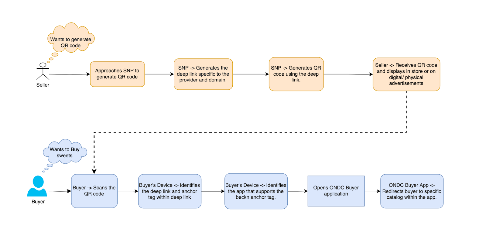

# Beckn Enabled Deep Links
## Objective
To facilitate seamless and standardized user interactions across digital ecosystems on ONDC, it is crucial to create a universally recognized and standardized "beckn" URI scheme, similar to what Unified Payments Interface (UPI), and WhatsApp, has achieved for major platforms like Web, Android and iOS, thus enhancing deep linking capabilities for entities using the Beckn protocol. Furthermore, the scheme should have easy integration and accessibility through software languages like Java, Python, among others.

## Problem Statement

Currently, beckn interactions primarily rely on URL-based RESTFul interfaces that are generic and require additional information carried on wire. Moreover, in an unbundled and interoperable framework, there is a need for a standard whereby creation of information datum needs to be standardized creating the possibility of invoking boilerplate codes for specific actions. To enable widespread adoption and interoperability within the ecosystem, there is a need to establish a universally recognized beckn anchor tag that seamlessly integrates with major platforms, similar to UPI, WhatsApp, messaging interfaces (such as XMPP) etc.

For the current use case of enabling QR codes for merchant shops (providers), merchants lack a unified method to generate QR codes, irrespective of the interfaces where the QR will be consumed, which may direct customers to their specific offerings and catalog within the beckn ecosystem adopted by ONDC. Even with the QR codes created, the consumers scanning the QR codes might encounter varied landing experiences due to the absence of a standardized deep linking mechanism via anchor tags.

Hence, in order to increase the accessibility and adoption, embedded QR code is required to direct the consumers to apps compliant with beckn. There is a need for unbundling consumer experience, primarily integrated through buyer apps, at the merchant stores. This will also help the merchants to broaden their reach on ONDC network enabling buyers to buy from identified stores of their choice.

## Proposed Solution

ONDC proposes to introduce beckn as an identified anchor tag and established protocol within developer community and platforms such as openJDK, Android, iOS etc.  As the first use case, ONDC proposes to enable QR code features for merchants facilitated by their respective BPPs (Seller Apps in this context).


Creating a QR code with data drafted in a deep link enabled through anchor tags of beckn in line of what UPI/ WhatsApp/XMPP have enabled, will enable the discovery of stores and their catalog on the buyer app of their choice. Consumers shall scan such QR stores visibly available on stores onboarded on ONDC through a seller app and will be offered for downloading and displaying in the store. Each BAP (buyer app) shall need to enable a standard anchor tag identified through a beckn complaint application and make the store catalog visible on device. The QR code shall make information available in format below. There are two suggestive modes of operation for this anchor tag, however, buyer Apps are free to innovate and create more handles to provide experience to their buyers. 
- The default scanner apps will point to all beckn enabled apps installed on the phone offering buyer a choice to pick one of them. 
- The same QR code shall become scannable as an input within App to fetch and render catalog of a specific provider ID as extracted from the URI string mentioned below.

As the primary goal specifically for generating and interpreting QR codes for  onboarded merchants in the ONDC ecosystem, defining the **well-defined schema and structure for the beckn anchor tag**. This QR code will be available at a seller place like in-store displays, physical advertisements etc. which can be scanned by any buyer willing to engage with a particular seller and their catalog while visiting the store. While a QR code is scanned, it will identify the apps that support the URI or are beckn enabled and will return an on_search response with the catalog. 

The deep link for QR code in store is mentioned below:
```
beckn://ret10.ondc?context.bpp_id=biz.enstore.combiz.enstore.com&message.intent.provider.id=p1234p1234&context.domain=ONDC:RET10&context.action=search
```

### Data fields:
The fields provided here are examples and serve as a guidance. As use cases evolve and expand, the input fields in the deep link may also grow or change to cater to the specific needs and scenarios. The field structure refers to the beckn protocol specifications. Below fields are populated based on the use cases defined in below sections.
| Fields                                     | Description                                              | Example                 | Default | Mandatory |
|--------------------------------------------|----------------------------------------------------------|-------------------------|---------|-----------|
| source_id                                  | Source identifier of the deep link generator             | UUID                    | -       | Yes       |
| context.bpp_id                             | Subscriber ID of the BPP                                 | seller-np.com           | -       | No        |
| context.version                            | Version of transaction protocol                          | 1.1.0                   | -       | No        |
| message.intent.provider.id                 | Id of the provider/ merchant                             | P1                      | -       | No        |
| context.domain                             | ONDC domain code relevant to BPP                         | ONDC:RET10              | -       | No        |
| context.action                             | search, as relevant to searching the catalog.            | search                  | search  | No        |
| context.location.city.code                 | City code defining the location of buyer and serviceability of seller | std:080 | -       | No        |
| message.intent.category.id                 | Category id within the domain                            | Foodgrains              | -       | No        |
| message.intent.category.descriptor.code    | Category code to define the search category              | HEALTH_INSURANCE        | -       | No        |
| message.intent.fulfillment.stops.type      | Type of fulfillment stops                                | start                   | -       | No        |
| message.intent.fulfillment.stops.location.gps | Gps location for type of fulfillment stop               | 28.5566842,77.0980399   | -       | No        |
| message.intent.provider.items.0.id         | Search Item by ID                                        | 11                      | -       | No        |
| message.order.provider.items.0.id          | Add item to cart                                         | 11                      | -       | No        |

### QR Code Generation
BPPs would facilitate the sellers to generate the QR codes specific to the provider. ONDC will offer [open-source SDKs](https://github.com/ONDC-Official/reference-implementations/tree/main/utilities/deep-links/qr_code_generator) and [utility](http://qrmaker.ondc.org) designed to produce QR codes embedded with merchant-specific information. However, seller Apps may decide to provide their own feature and technology sets to generate standard QR codes with appropriate density for each scanning of the code.
### URI Scheme Recognition
Each BAP application that are beckn enabled would need to add `beckn` as the supported URI scheme and define specific domain (which they are subscribed to) in the host definition. When the QR code with deep link - `beckn://<domain>.ondc?bppID=....` is scanned, the system checks for installed applications which can handle the `beckn://<domain>.ondc`[^1]. For ex., when a QR code with deep link - beckn://ret10.ondc?... is scanned, BAP applications subscribed to specific domains will pop up as available options.

### Platform Integrations
Different platforms have different handling mechanisms, for example, Android uses Intent Filters and iOS uses URL schemes or Universal links to identify which apps can handle which URI schemes or use fallback URLs to redirect the consumer to a fallback web URL, usually prompting them to download the relevant app. If multiple apps have registered the same URI scheme, it will either redirect to the default app or prompt the user to select the app they would like to use. Please refer [here](https://docs.google.com/document/d/1pmwQvF9G37_KwcFViub7m_qYDUjbGLrwvgkv1XZEc08/edit?usp=sharing) for a detailed guide on implementation.

### Network Identification
The `<domain.network>`[^2] component in the deep link identifies the specific network and domain to which the request belongs to. For example, 
```
beckn://<domain.network>?bpp_id=biz.enstore.com&intent.provider.id=p1234&action=search
```
The BAPs would need to maintain a local lookup table that maps the unique network identifier to the respective registry endpoint based on the network. The registry endpoint may be an API endpoint, a github endpoint, or a local registry DB to lookup the network participants of the specified network.

### Interpreting Deep Link
The interpretation of a beckn deep link depends on the specific parameters and values included in the deep link URL. Beckn deep links are designed to convey specific instructions or information to Beckn enabled applications (Buyer Application Platforms or BAPs). Here's a general guide on how a beckn deep link is typically interpreted:

**Beckn Deep Link Structure:**
```
beckn://<domain.network>?context.bpp_id=<BPP_ID>&message.intent.provider.id=<provider_ID>&context.action=<search>
```
1. Scheme (`beckn://`): The custom URI scheme that indicates the deep link is specifically for beckn enabled apps or services.
2. Network (`domain.ondc`): The `<domain.network> `component in the deep link identifies the specific network and domain to which the request belongs to. For example, here it indicates the ONDC (Open Network for Digital Commerce) network and the specific domain NP is subscribed to. The BAPs would need to maintain a local lookup table to identify the registry endpoint based on the network. For example, `ret10.ondc`.
3. Query Parameters: The query parameters are key-value pairs included in the deep link, and they convey specific information for BAP to consume and redirect the user accordingly. All the query parameters are optional.
### Advantage of deep links 
Defining deep links can help in the following:
A standardized schema and structure to QR code generation and interpretation.
Consumers are guaranteed a consistent experience regardless of which merchant's QR code they scan.
With a standard protocol in place, developers can build and scale faster.
Merchants can run targeted campaigns, knowing they can direct users to specific actions or pages seamlessly.

### Use Cases:
Deep linking with the beckn URI scheme can open the door to a wide range of use cases, each designed to enhance user interaction, convenience, and efficiency across different domains within the ONDC network. While the possibilities are vast, we've cataloged a few illustrative use cases to showcase the potential of this technology.


#### 1. Catalog Access through Seller-Generated QR Codes
Imagine a buyer walking into a store and having the power to view the complete merchant's catalog using their smartphone. By scanning a QR code generated by the seller (facilitated by BPP), customers can have instant access to the entire inventory, enhancing the shopping experience while making it more efficient.

Deep Link Structure:
```
beckn://ret10.ondc?context.bpp_id=sellerapp.com&message.intent.provider.id=P1&context.action=search
```

When a buyer scans the QR code, the system (buyer’s mobile device) looks for applications that support beckn URI scheme. Once a buyer chooses one specific buyer application (BAP) from the list of applications supported by beckn, the BAP identifies the network as ONDC and based on the parameters, BAP identifies the action as search, which is the discovery phase and redirects the buyer to the catalog for `sellerapp.com`.P1 for Grocery (ONDC:RET10) domain from cache. 

The deep link might also look like:
```
beckn://ret10.ondc?context.bpp_id=sellerapp.com&message.intent.provider.id=P1
```
Here default action being search, the buyer will be able to explore the complete catalog irrespective of domains for the specific provider P1 onboarded on bpp - sellerapp.com.


#### 2. Category-Specific Browsing via Seller-Generated QR Codes
The seller might want to create QR codes for each category of products, for example `Foodgrains` in Grocery, which will guide customers to a specific product category, streamlining their search.
Deep Link Structure:
```
beckn://ret10.ondc?context.bpp_id=sellerapp.com&message.intent.provider.id=P1&message.intent.provider.locations.0.id=L1&context.action=search&message.intent.category.id=Foodgrains
```

OR

```
beckn://ret10.ondc?context.bpp_id=sellerapp.com&message.intent.provider.id=P1&message.intent.provider.locations.0.id=L1&context.action=search&message.intent.category.id=RET10-101F
```

#### 3. Detailed Product Insight with Seller-Generated QR Codes
For products that require a deeper understanding—be it tech gadgets with intricate specifications or luxury goods with detailed craftsmanship—sellers can generate QR codes. Once scanned, these codes will lead customers to a product details page for the specific product.
Deep Link Structure:
```
beckn://ret14.ondc?context.bpp.id=sellerapp.com&message.intent.provider.id=P1&message.intent.provider.locations.0.id=L1&context.action=search&message.intent.item.id=I1
```
#### 4. Hassle-Free Metro Ticket Booking with QR Codes
Imagine a QR code present at a public place, like Metro. When a buyer scans the QR code, they are redirected to the buyer app with their current location already set in the buyer app, simplifying their commute process.

Deep Link Structure:
```
beckn://trv11.ondc?context.bpp_id=mobilitysellerapp.com&context.action=search&message.intent.fulfillments.vehicle.category=METRO
```
**Data Fields:**
| Fields                                      | Description                                            | Example        | Default | Mandatory |
|---------------------------------------------|--------------------------------------------------------|----------------|---------|-----------|
| context.bpp_id                              | Subscriber ID of the BPP                               | seller-np.com  | -       | Yes       |
| message.intent.provider.id                  | Id of the provider/ merchant                           | P1             | -       | No        |
| message.intent.fulfillments.vehicle.category| Type of Vehicle                                        | METRO          | -       | Yes       |
| context.action                              | search, as relevant to searching the offering.         | search         | search  | No        |


#### 5. Explore and buy Health Insurance with QR codes
Imagine a buyer comes across a beckn-enabled QR code through an advertisement that promises a hassle-free purchase experience for a health insurance policy.

Deep Link Structure:
```
beckn://fis13.ondc?context.bpp.id=fis.bpp.com&context.action=search&message.intent.category.descriptor.code=HEALTH_INSURANCE
```

#### 6. Directly adding products to cart just by scanning the product QR code
Imagine each product in the store has a beckn-enabled QR code associated with it, which links to the product's online listing. The QR code contains a deep link with all the necessary information for adding the product to the cart.
Deep Link Structure:
```
beckn://ret14.ondc?context.bpp_id=sellerapp.com&message.order.provider.id=P1&context.action=select&message.order.provider.items.0.id=111
```

## Considerations
1. The merchant generated QR code will have specific bpp id and provider id in the deep link. Hence, a BAP can either: 
    - Show the catalog from cache 
    - Send a live search to all BPPs and then show specific merchant’s catalog
2. All BAPs would need to support beckn anchor tags across different platforms i.e. web, android and iOS.
3. The BAPs would need to maintain a local lookup for registry endpoints based on the network, in case the BAP is complying to multiple networks within beckn.
4. **Custom URI Schemes in QR Codes Across Different OS:** 
    
    a. <u>iOS</u>: Camera in iOS supports scanning of QR codes natively. However, as iOS does not recognise "beckn" as an identified scheme, if multiple apps support "beckn" scheme, the criteria by which iOS chooses supported application is undefined. There’s no mechanism to change the app or to change the order apps appear in a Share sheet. Consult the [iOS developer guide](https://developer.apple.com/documentation/xcode/defining-a-custom-url-scheme-for-your-app) for more details.
  
    b. <u>Android</u>: As android is an open-source OS, the implementation of camera features, including QR code scanning, varies by phone model. Not all phone cameras may support QR code scanning natively. Hence the QR code works with QR code scanner apps or in-app scanner of buyer apps. The order of supported apps shown by OS is undefined. However, apps can set priority of the intent filter. Consult the [Android developer guide](https://developer.android.com/guide/topics/manifest/intent-filter-element#priority) for more details.

---
[^1]: In order to maintain backward compatibility, Buyer apps should retain support for the “ondc” host in their Android manifest and add support for the new domain-specific hosts (`<domain>.ondc`) as well.

[^2]: In order to maintain backward compatibility, Buyer apps should retain support for the ondc host in their Android manifest and add support for the new domain-specific hosts (`<domain>.ondc`) as well.